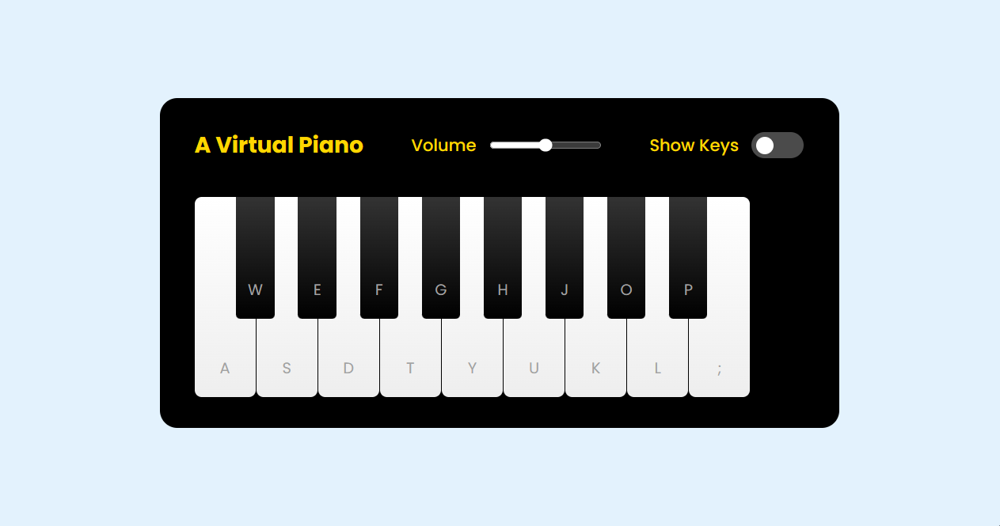

# A Virtual Piano

    
Pequeno projeto simulando um piano feito com HTML, CSS e Javascript é o 3º dos 4 projetos do Bootcamp Potência Tech iFood - Desenvolvimento de Jogos.

## Tecnologias Utilizadas

### Modificações

- Adição de um favicon;
    - **Pendente**: Permitir que múltiplas notas sejam tocadas ao mesmo tempo;
    - **Pendente**: Adicionar funcionalidade de temas claro e escuro.

### Contribuições

Sintam-se livres para adicionar recursos, corrigir problemas, polir o código ou usá-lo de referência.

### Créditos

Este jogo foi desenvolvido como parte de um projeto educacional da Digital Innovation One em parceria com o iFood para o Bootcamp Potência Tech iFood - Desenvolvimento de Jogos. 

---

Não se esqueça de visitar o <a href="https://github.com/felipeAguiarCode/js-music-keyboard-virtual">repositório original</a>, criado pelo instrutor <a href="https://github.com/felipeAguiarCode">Felipe Aguiar</a>, da DIO e deixar uma ⭐️ caso goste.
